### 1_Real - Objectives (OKRs)

**Objective**: Automate the creation of high-quality multimedia assets for weekly video production using generative AI models via the fal.ai API and Gemini agent.

```mermaid
graph TB
    A[🎯 Objective: Automated Weekly Video Pipeline] --> B[KR1: Batch Generators]
    A --> C[KR2: Gemini Integration]
    A --> D[KR3: DaVinci Resolve Ready]
    A --> E[KR4: Reporting System]
    A --> F[KR5: Versioning & Manifest]
    
    B --> B1[✅ Video, Audio, Images]
    B --> B2[✅ Diagrams, Icons, SVG, Mermaid]
    B --> B3[✅ Base Class Architecture]
    C --> C1[✅ fal-client Integration]
    C --> C2[🔄 Gemini Analysis]
    D --> D1[✅ Production Quality]
    D --> D2[✅ Standardized Naming]
    E --> E1[✅ Cost Reports]
    E --> E2[✅ Asset Manifests]
    E --> E3[✅ 14 GitHub Actions Workflows]
    F --> F1[✅ Versioning System]
    F --> F2[✅ Manifest Tracking]
    F --> F3[✅ Asset Utils & Tests]
    
    style A fill:#e1f5ff
    style B fill:#d4edda
    style C fill:#d4edda
    style D fill:#d4edda
    style E fill:#d4edda
    style F fill:#d4edda
```

**Key Results**:

- **KR1**: ✅ Established a robust suite of Python scripts for batch asset generation (Video, Audio, Images, Icons, Diagrams, SVG, Mermaid) with base class architecture for maintainability.
- **KR2**: ✅ Successfully integrated `fal-client` to programmatically generate content from text prompts. 🔄 Gemini agent integration planned.
- **KR3**: ✅ Producing production-ready assets (1080p video, audio, graphics) optimized for DaVinci Resolve timeline integration with standardized naming conventions.
- **KR4**: ✅ Minimized manual workflow time with comprehensive reporting system including 14 GitHub Actions workflows, cost analysis, and automated asset manifests.
- **KR5**: ✅ Implemented versioning system and manifest tracking for complete asset traceability from prompt to file.
