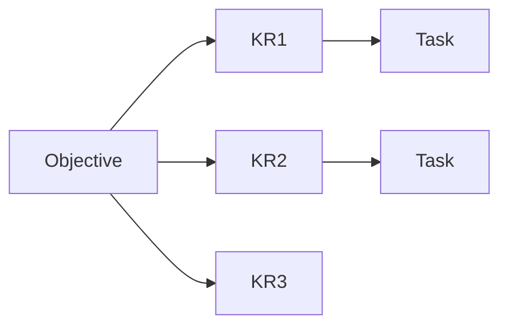
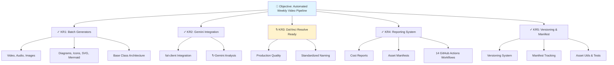

Here's a sanity check of your Mermaid diagram and the key issues identified:

## ✅ **What's Good:**

- Clear hierarchy from Objective → Key Results → Sub-tasks
- Visual status indicators (✅/🔄) are helpful
- Logical grouping of related components
- Good use of color coding (blue for objective, green for completed KRs)

## ⚠️ **Issues & Recommendations:**

### **1. Logical Inconsistency**

- **Problem**: The diagram shows KR3 (`DaVinci Resolve Ready`) as completed (✅), but its sub-task C2 (`Gemini Analysis`) is still in progress (🔄). This creates a logical conflict - a parent KR shouldn't be marked complete if its critical sub-task isn't finished.
- **Fix**: Either:
  - Change KR3 to 🔄 (in progress)
  - Or move C2 to a different parent if it's not blocking KR3

### **2. Visual Clutter with Emojis**

- **Problem**: Using emojis as both bullet points (🎯, ✅, 🔄) and within node text creates visual noise
- **Fix**: Consider simplifying:

  ```mermaid
  A[Objective: Automated Weekly Video Pipeline]
  B[KR1: Batch Generators ✓]
  C[KR2: Gemini Integration ✓]
  ```

### **3. Missing Dependencies/Connections**

- **Problem**: No arrows showing dependencies between KRs (e.g., does Gemini Integration depend on Batch Generators?)
- **Fix**: Add dependency arrows if there are sequential relationships

### **4. Inconsistent Naming**

- **Problem**: Mix of technical labels (C1, B3) and descriptive labels makes scanning harder
- **Fix**: Use either:
  - All technical: `B → B1, B2, B3`
  - All descriptive: `B → Video/Audio/Images, Diagrams/Icons/SVG, Base Class Architecture`

### **5. Status Ambiguity**

- **Problem**: What does "✅" mean exactly? Completed this week? Overall completion?
- **Fix**: Add a legend or use more specific status:
  - `✓` = Complete
  - `↻` = In Progress  
  - `⏸️` = Blocked
  - `🔲` = Not Started

### **6. Layout Suggestion**

The diagram would be clearer with a left-to-right flow instead of top-down:



## **Quick Fix Version:**



The main critical issue is **#1** - the completion status inconsistency needs to be resolved for accurate tracking.
