### 1_Real - Objectives (OKRs)

**Objective**: Automate the creation of high-quality multimedia assets for weekly video production using generative AI models via the fal.ai API and Gemini agent.

```mermaid
graph TB
    A[🎯 Objective: Automated Weekly Video Pipeline] --> B[KR1: Batch Generators]
    A --> C[KR2: Gemini Integration]
    A --> D[KR3: DaVinci Resolve Ready]
    A --> E[KR4: Reporting System]
    
    B --> B1[✅ Video, Audio, Images]
    B --> B2[✅ Diagrams, Icons]
    C --> C1[✅ fal-client Integration]
    C --> C2[🔄 Gemini Analysis]
    D --> D1[✅ Production Quality]
    D --> D2[✅ Standardized Naming]
    E --> E1[✅ Cost Reports]
    E --> E2[✅ Asset Manifests]
    
    style A fill:#e1f5ff
    style B fill:#d4edda
    style C fill:#d4edda
    style D fill:#d4edda
    style E fill:#d4edda
```

**Key Results**:
- **KR1**: Establish a robust suite of Python scripts for batch asset generation (Video, Audio, Images, Icons, Diagrams).
- **KR2**: Successfully integrate `fal-client` and Gemini agent to programmatically generate content from text prompts.
- **KR3**: Produce production-ready assets (1080p/4k video, audio, graphics) optimized for DaVinci Resolve timeline integration.
- **KR4**: Minimize manual workflow time by automating the prompt-to-asset pipeline with comprehensive reporting.
