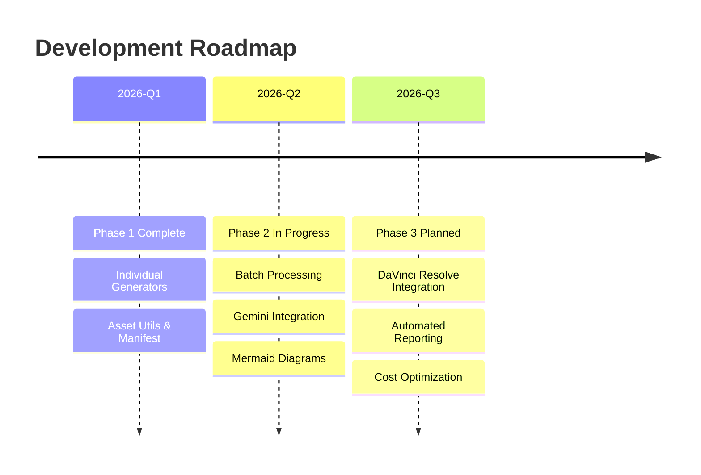

### 2_Environment - Roadmap and Use Cases

**Environment**:
- **Language**: Python 3.8+
- **Libraries**: `fal-client`, `dotenv`, standard libraries (`json`, `os`, `pathlib`)
- **Platforms**: 
  - ☁️ **GitHub Codespaces** (Recommended for teams)
  - 🪟 **Windows 10/11**
  - 🍎 **macOS**

**Roadmap**:
1.  **Phase 1: Script Development** (✅ Completed) - Creation of individual generators for all asset types.
2.  **Phase 2: Integration & Automation** (🔄 In Progress) - Gemini agent integration, Mermaid diagrams, reporting system.
3.  **Phase 3: Production Pipeline** (📋 Planned) - DaVinci Resolve workflow automation, advanced cost optimization.

**Use Cases**:
- **Weekly Video Production**: Automated asset generation for regular content schedules
- **B-Roll Generation**: Creating atmospheric video clips to support narratives
- **Audio Synthesis**: Generating background music and sound effects matched to scenes
- **Visual Documentation**: 
    - **Mermaid Diagrams**: Workflow and architecture visualizations
    - **Icons**: Minimalist assets for explanations
    - **Lower Thirds**: Text overlays for speaker identification
    - **Chapter Markers**: Visual breaks for video segments
- **DaVinci Resolve Integration**: Direct import with organized naming
