### 2_Environment - Technical Environment and Roadmap

> 🌍 **Complete environment setup, configuration, and development roadmap for the weekly video production pipeline**

---

## 📋 Overview

This directory documents the complete technical environment for the **fal.ai Weekly Video Production Pipeline**. It covers all aspects of the development stack, configuration files, CI/CD setup, and the project roadmap.

---

## 🐍 Python Environment

**Language**: Python 3.8+

**Virtual Environment**: All platforms use `.venv` directory with platform-specific activation:
- Linux/macOS: `source .venv/bin/activate`
- Windows: `.venv\Scripts\activate`
- GitHub Codespaces: Pre-configured

**Python Command Usage**:
- Linux/macOS/Codespaces: `python3` and `pip` (within venv)
- Windows: `python` and `pip` (Windows convention)
- See platform-specific setup guides below for details

**Core Dependencies** ([`requirements.txt`](../requirements.txt)):
- **`fal-client>=0.13.0,<1.0.0`** - Official fal.ai API client for AI model generation
- **`Pillow>=10.0.0`** - Image processing and JPEG conversion
- **`cairosvg>=2.7.0`** - SVG to PNG/JPEG conversion for diagrams
- **`python-dotenv>=1.0.0`** - Environment variable management from `.env` files
- **`PyYAML>=6.0`** - YAML configuration file parsing

**Installation**:
```bash
# Within activated virtual environment
pip install -r requirements.txt

# Or for reliability across all systems
python3 -m pip install -r requirements.txt  # Linux/macOS
python -m pip install -r requirements.txt   # Windows
```

---

## ⚙️ Configuration Files

### 🔑 Environment Variables
- **[`4_Formula/.env.sample`](../4_Formula/.env.sample)** - Template for local environment configuration
  - `FAL_KEY` - fal.ai API key for model generation (local development)
  - `GOOGLE_API_KEY` - Google Custom Search API key
  - `GOOGLE_CSE_ID` - Google Custom Search Engine ID

**Note**: For GitHub Actions, the secret is named `FAL_API_KEY` but is mapped to the `FAL_KEY` environment variable via workflow configuration (see workflow files for examples).

### 🎯 Generator Configuration
- **[`5_Symbols/base/generator_config.py`](../5_Symbols/base/generator_config.py)** - Centralized generator settings
  - Default model configurations (image, video, audio, 3D)
  - Brand color palette and seeds for consistency
  - Output format specifications (JPEG, PNG, MP4, etc.)
  - Image size presets (HD, square, portrait)

### 📁 Path Management
- **[`5_Symbols/paths_config.py`](../5_Symbols/paths_config.py)** - Centralized path configuration
  - Weekly directory structure management
  - Input/output path resolution
  - Repository root detection

---

## 🚀 CI/CD Environment

### GitHub Actions Workflows
**14 Automated Workflows** ([`.github/workflows/`](../.github/workflows/)):

| Workflow | Purpose | File |
|----------|---------|------|
| 🎨 **SVG Generator** | Generate SVG diagrams | [`bulk-svg-generator.yml`](../.github/workflows/bulk-svg-generator.yml) |
| 📊 **Mermaid Generator** | Generate Mermaid diagrams | [`bulk-mermaid-generator.yml`](../.github/workflows/bulk-mermaid-generator.yml) |
| 🎵 **Audio Generator** | Generate audio assets | [`batch-asset-generator-audio.yml`](../.github/workflows/batch-asset-generator-audio.yml) |
| 🎬 **Video Generator** | Generate video clips | [`batch-asset-generator-video.yml`](../.github/workflows/batch-asset-generator-video.yml) |
| 🖼️ **Image Generator** | Generate images | [`batch-asset-generator-images.yml`](../.github/workflows/batch-asset-generator-images.yml) |
| 🧩 **Icon Generator** | Generate icons | [`batch-asset-generator-icons.yml`](../.github/workflows/batch-asset-generator-icons.yml) |
| 📈 **Diagram Generator** | Generate diagrams | [`batch-asset-generator-diagrams.yml`](../.github/workflows/batch-asset-generator-diagrams.yml) |
| 🎨 **Graphics Generator** | Generate graphics | [`batch-asset-generator-graphics.yml`](../.github/workflows/batch-asset-generator-graphics.yml) |
| 📺 **Lower Thirds Generator** | Generate lower thirds | [`batch-asset-generator-lower-thirds.yml`](../.github/workflows/batch-asset-generator-lower-thirds.yml) |
| 🧠 **Memory Palace Generator** | Generate memory palace assets | [`batch-asset-generator-memory-palace.yml`](../.github/workflows/batch-asset-generator-memory-palace.yml) |
| 🎵 **Music Generator** | Generate music tracks | [`batch-asset-generator-music.yml`](../.github/workflows/batch-asset-generator-music.yml) |
| 📖 **Chapter Markers Generator** | Generate chapter markers | [`batch-asset-generator-chapter-markers.yml`](../.github/workflows/batch-asset-generator-chapter-markers.yml) |
| 🎛️ **Master Generator** | Orchestrate all generators | [`master-asset-generator.yml`](../.github/workflows/master-asset-generator.yml) |
| 🚀 **All Bulk Generators** | Run multiple generators at once | [`all-bulk-generators.yml`](../.github/workflows/all-bulk-generators.yml) |

**Secrets Configuration**:
- `FAL_API_KEY` - Repository secret for fal.ai API access (mapped to `FAL_KEY` environment variable in workflows)
- See [`.env.sample`](../4_Formula/.env.sample) for required environment variables

**Detailed Documentation**: [`.github/workflows/README.md`](../.github/workflows/README.md)

---

## 📂 Project Structure

The project follows a **7-layer architecture** for separation of concerns:

| Directory | Purpose | Key Files | Documentation |
|-----------|---------|-----------|---------------|
| **[`1_RealUnknown/`](../1_RealUnknown/)** | 🎯 Objectives & Key Results (OKRs) | [`README.md`](../1_RealUnknown/README.md) | Project goals and KPIs |
| **[`2_Environment/`](./)** | 🌍 Technical Environment | [`README.md`](./README.md) | This file - environment setup |
| **[`3_Simulation/`](../3_Simulation/)** | 🎨 Asset Workspace | `2026-02-*/` | Generated assets and simulations |
| **[`4_Formula/`](../4_Formula/)** | 📖 Setup & Best Practices | [`README.md`](../4_Formula/README.md), [`.env.sample`](../4_Formula/.env.sample) | Guides and documentation |
| **[`5_Symbols/`](../5_Symbols/)** | 💻 Core Source Code | All `.py` generators | Main codebase |
| **[`6_Semblance/`](../6_Semblance/)** | 🔧 Troubleshooting | [`README.md`](../6_Semblance/README.md) | Error solutions and debugging |
| **[`7_TestingKnown/`](../7_TestingKnown/)** | ✅ Quality Assurance | [`README.md`](../7_TestingKnown/README.md) | Testing and validation |

---

## 💻 Platform Support

**Supported Platforms**:

| Platform | Setup Guide | Description |
|----------|-------------|-------------|
| ☁️ **GitHub Codespaces** | [Setup Guide](./SETUP_GITHUB_CODESPACES.md) | **Recommended for teams** - Pre-configured development environment |
| 🪟 **Windows 10/11** | [Setup Guide](./SETUP_WINDOWS.md) | Full Python 3.8+ support with PowerShell/CMD |
| 🍎 **macOS** | [Setup Guide](./SETUP_MACOS.md) | Native Python 3.8+ support with Terminal |
| 🐧 **Linux** | [Setup Guide](./SETUP_LINUX.md) | Full Python 3.8+ support (Ubuntu, Debian, Fedora, Arch) |

**Environment Setup Methods**:
1. **Local Development**: `.env` file (loaded via `python-dotenv`)
2. **GitHub Actions**: Repository Secrets (`FAL_KEY`, etc.)
3. **Codespaces**: Pre-configured devcontainer with all dependencies

Each platform guide includes:
- ✅ Prerequisites and installation steps
- ✅ Python environment setup
- ✅ API key configuration
- ✅ Running generators
- ✅ Platform-specific troubleshooting
- ✅ Verification checklist

---

## 🗓️ Development Roadmap

```mermaid
timeline
    title Development Roadmap
    2026-Q1 : Phase 1 Complete ✅
           : Individual Generators
           : Asset Utils & Manifest
           : Versioning System
           : Base Class Architecture
    2026-Q2 : Phase 2 In Progress 🔄
           : GitHub Actions (14 workflows)
           : Batch Processing
           : Mermaid & SVG Diagrams
    2026-Q3 : Phase 3 Planned 📋
           : Gemini AI Integration
           : Advanced DaVinci Integration
           : Cost Optimization
```



### Phase 1: Script Development ✅ (Completed)
**Focus**: Core generator infrastructure and asset management

**Key Deliverables**:
- ✅ Individual asset generators for all types (video, audio, images, 3D, etc.)
- ✅ Versioning system with standardized naming ([`5_Symbols/base/`](../5_Symbols/base/))
- ✅ Manifest tracking for asset traceability
- ✅ Base class architecture for maintainability ([`base_asset_generator.py`](../5_Symbols/base/base_asset_generator.py))
- ✅ Asset utilities and test suite ([`asset_utils.py`](../5_Symbols/Utils/asset_utils.py), [`test_asset_utils.py`](../7_TestingKnown/Tests/test_asset_utils.py))

**Documentation**:
- [`VERSIONING_AND_MANIFEST.md`](../4_Formula/VERSIONING_AND_MANIFEST.md)
- [`5_Symbols/README.md`](../5_Symbols/README.md)

### Phase 2: Integration & Automation 🔄 (In Progress)
**Focus**: CI/CD automation and diagram generation

**Key Deliverables**:
- ✅ 14 GitHub Actions workflows ([`.github/workflows/`](../.github/workflows/))
- ✅ Batch processing system ([`MasterAssetGenerator.py`](../5_Symbols/MasterAssetGenerator.py))
- ✅ Mermaid diagram generation ([`BulkMermaidGenerator.py`](../5_Symbols/Diagrams/BulkMermaidGenerator.py))
- ✅ SVG diagram generation ([`BulkSVGGenerator.py`](../5_Symbols/Diagrams/BulkSVGGenerator.py))
- 🔄 Gemini integration (partial: prompt enhancement + fallback generation working, full script analysis in progress)

**Documentation**:
- [`.github/workflows/README.md`](../.github/workflows/README.md)
- [`4_Formula/README.md`](../4_Formula/README.md)

### Phase 3: Production Pipeline 📋 (Planned)
**Focus**: Advanced workflow automation and optimization

**Planned Features**:
- 📋 Advanced DaVinci Resolve timeline automation
- 📋 Full Gemini AI integration for script analysis
- 📋 Advanced cost optimization algorithms
- 📋 Enhanced 3D asset pipeline
- 📋 Real-time generation monitoring

---

## 🎯 Use Cases

### Core Use Cases with Links

| Use Case | Description | Key Generators | Documentation |
|----------|-------------|----------------|---------------|
| **📅 Weekly Video Production** | Automated asset generation for regular content schedules | [`MasterAssetGenerator.py`](../5_Symbols/MasterAssetGenerator.py) | [`README.md`](../README.md) |
| **🎬 B-Roll Generation** | Creating atmospheric video clips to support narratives | [`BatchAssetGeneratorVideo.py`](../5_Symbols/Video/BatchAssetGeneratorVideo.py) | [`README.md`](../5_Symbols/README.md) |
| **🎵 Audio Synthesis** | Generating background music and sound effects | [`BatchAssetGeneratorMusic.py`](../5_Symbols/Audio/BatchAssetGeneratorMusic.py), [`BatchAssetGeneratorAudio.py`](../5_Symbols/Audio/BatchAssetGeneratorAudio.py) | [`README.md`](../5_Symbols/README.md) |
| **📊 Visual Documentation** | Diagrams, icons, and visual explanations | [`BulkMermaidGenerator.py`](../5_Symbols/Diagrams/BulkMermaidGenerator.py), [`BulkSVGGenerator.py`](../5_Symbols/Diagrams/BulkSVGGenerator.py) | [Workflows README](../.github/workflows/README.md) |
| **🎞️ DaVinci Resolve Integration** | Direct import with standardized naming and scene organization | All generators with versioning | [`VERSIONING_AND_MANIFEST.md`](../4_Formula/VERSIONING_AND_MANIFEST.md) |
| **🤖 CI/CD Asset Generation** | Automated asset creation via GitHub Actions workflows | All 14 workflows | [`.github/workflows/README.md`](../.github/workflows/README.md) |

### Detailed Use Cases

- **Weekly Video Production**: Automated asset generation for regular YouTube/social media content
  - Batch process dozens of assets per week
  - Standardized naming for DaVinci Resolve import
  - Cost tracking and reporting

- **B-Roll Generation**: Creating atmospheric video clips to support narratives
  - **1080p Full HD video generation** (standard footage resolution)
  - 4K video generation available for premium content
  - Consistent scene numbering
  - Metadata tracking for prompts

- **Audio Synthesis**: Generating background music and sound effects matched to scenes
  - Background music tracks
  - Sound effects and ambience
  - WAV/MP3 format support

- **Visual Documentation**:
  - 📊 **Mermaid Diagrams**: Workflow and architecture visualizations
  - 🎨 **SVG Diagrams**: Professional vector graphics for explanations
  - 📈 **Infographics**: Data visualization and overlay graphics for scenes
  - 🧩 **Icons**: Minimalist assets for UI overlays
  - 📺 **Lower Thirds**: Text overlays for speaker identification
  - 📖 **Chapter Markers**: Visual breaks for video segments

- **DaVinci Resolve Integration**: Direct import with standardized naming and scene-based organization
  - Automatic scene numbering (`001_`, `002_`, etc.)
  - Version tracking (`_v1`, `_v2`, etc.)
  - Complete manifest for metadata reference

- **CI/CD Asset Generation**: Automated asset creation via GitHub Actions workflows
  - Manual trigger for on-demand generation
  - Automatic trigger on code changes
  - Artifact storage for 30 days

---

## 🔗 Quick Links

### Setup & Configuration
- 📦 [Installation Guide](../README.md#-quick-start-guide)
- 🔑 [API Key Setup](../4_Formula/SETUP_API_Key.md)
- ⚙️ [Configuration Files](../4_Formula/.env.sample)
- ☁️ [GitHub Codespaces Setup](./SETUP_GITHUB_CODESPACES.md)
- 🪟 [Windows Setup](./SETUP_WINDOWS.md)
- 🍎 [macOS Setup](./SETUP_MACOS.md)
- 🐧 [Linux Setup](./SETUP_LINUX.md)

### Development
- 💻 [Core Generators](../5_Symbols/README.md)
- 🏗️ [Base Architecture](../5_Symbols/base/)
- 📝 [Versioning System](../4_Formula/VERSIONING_AND_MANIFEST.md)

### CI/CD & Automation
- 🤖 [GitHub Actions Workflows](../.github/workflows/README.md)
- 🎛️ [Master Generator](../5_Symbols/MasterAssetGenerator.py)
- 📊 [Workflow Triggers](../.github/workflows/)

### Documentation
- 🎌 [Anime Generator Guide](../4_Formula/ANIME_GENERATOR_GUIDE.md)
- 📚 [Formula & Best Practices](../4_Formula/README.md)
- 🔧 [Troubleshooting](../6_Semblance/README.md)
- ✅ [Testing Strategy](../7_TestingKnown/README.md)

### Project Management
- 🎯 [Objectives & KRs](../1_RealUnknown/README.md)
- 🎨 [Simulation Workspace](../3_Simulation/)
- 📋 [Main README](../README.md)
