```mermaid
timeline
    title Development Roadmap
    2026-Q1 : Phase 1 Complete ✅
           : Individual Generators
           : Asset Utils & Manifest
           : Versioning System
           : Base Class Architecture
    2026-Q2 : Phase 2 In Progress 🔄
           : GitHub Actions (14 workflows)
           : Batch Processing
           : Mermaid & SVG Diagrams
    2026-Q3 : Phase 3 Planned 📋
           : Gemini AI Integration
           : Advanced DaVinci Integration
           : Cost Optimization
```

### 2_Environment - Roadmap and Use Cases

**Environment**:
- **Language**: Python 3.8+
- **Libraries**: `fal-client>=0.13.0`, standard libraries (`json`, `os`, `pathlib`)
- **Platforms**: 
  - ☁️ **GitHub Codespaces** (Recommended for teams)
  - 🪟 **Windows 10/11**
  - 🍎 **macOS**

**Roadmap**:
1.  **Phase 1: Script Development** (✅ Completed) - Created all individual generators with versioning, manifest tracking, and base class architecture for maintainability.
2.  **Phase 2: Integration & Automation** (🔄 In Progress) - Implemented 14 GitHub Actions workflows, Mermaid/SVG diagrams. Gemini agent integration planned.
3.  **Phase 3: Production Pipeline** (📋 Planned) - Advanced DaVinci Resolve workflow automation, Gemini AI integration, advanced cost optimization.

**Use Cases**:
- **Weekly Video Production**: Automated asset generation for regular content schedules
- **B-Roll Generation**: Creating atmospheric video clips to support narratives
- **Audio Synthesis**: Generating background music and sound effects matched to scenes
- **Visual Documentation**: 
    - **Mermaid Diagrams**: Workflow and architecture visualizations
    - **SVG Diagrams**: Professional vector graphics for explanations
    - **Icons**: Minimalist assets for explanations
    - **Lower Thirds**: Text overlays for speaker identification
    - **Chapter Markers**: Visual breaks for video segments
- **DaVinci Resolve Integration**: Direct import with standardized naming and scene-based organization
- **CI/CD Asset Generation**: Automated asset creation via GitHub Actions workflows
