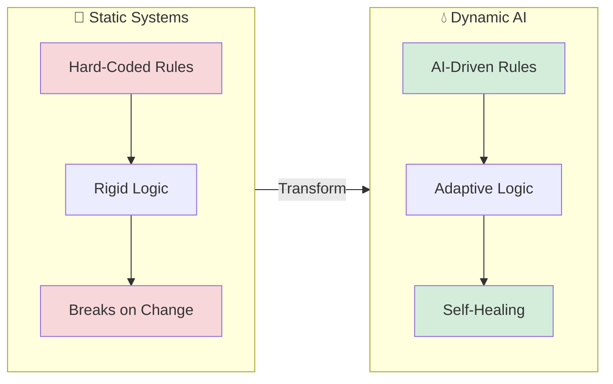

# Static Rules vs Dynamic AI

**Type:** flowchart
**Generated:** 2026-02-13T21:26:51.041366

```mermaid
flowchart LR
    subgraph Old[🗿 Static Systems]
        A[Hard-Coded Rules] --> B[Rigid Logic]
        B --> C[Breaks on Change]
    end
    subgraph New[💧 Dynamic AI]
        D[AI-Driven Rules] --> E[Adaptive Logic]
        E --> F[Self-Healing]
    end
    Old -->|Transform| New

    style A fill:#f8d7da
    style C fill:#f8d7da
    style D fill:#d4edda
    style F fill:#d4edda
```
