# Static Rules vs Dynamic AI

**Type:** flowchart
**Asset ID:** MM.03
**Generated:** 2026-02-13T21:51:13.804714

```mermaid
flowchart LR
    subgraph OLD["🗿 OLD WORLD - Static Systems"]
        direction TB
        A["📜 Hard-Coded Rules"] --> B["🔒 Rigid Logic"]
        B --> C["💥 Breaks on Change"]
        C --> D["🛑 System Down"]
    end
    subgraph NEW["💧 NEW WORLD - Dynamic AI"]
        direction TB
        E["🤖 AI-Driven Rules"] --> F["🌀 Adaptive Logic"]
        F --> G["🔄 Self-Healing"]
        G --> H["🚀 Always Running"]
    end
    OLD -->|"⚡ Transform"| NEW

    style A fill:#e74c3c,color:#fff
    style D fill:#c0392b,color:#fff
    style E fill:#2ecc71,color:#fff
    style H fill:#27ae60,color:#fff
```

---

*Generated by BulkMermaidGenerator.py*
*To render: paste the mermaid code into https://mermaid.live*
