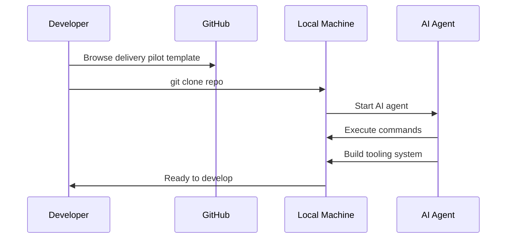

# Git Clone to Local Powerhouse

**Type:** sequence
**Generated:** 2026-02-13T21:26:51.043657

```mermaid
sequenceDiagram
    participant Dev as Developer
    participant GH as GitHub
    participant Local as Local Machine
    participant Agent as AI Agent

    Dev->>GH: Browse delivery pilot template
    Dev->>Local: git clone repo
    Local->>Agent: Start AI agent
    Agent->>Local: Execute commands
    Agent->>Local: Build tooling system
    Local->>Dev: Ready to develop
```
