# Git Clone to Local Powerhouse

**Type:** sequence
**Asset ID:** MM.04
**Generated:** 2026-02-13T21:51:15.060481

```mermaid
sequenceDiagram
    participant Dev as 👨‍💻 Developer
    participant GH as 🐱 GitHub
    participant Local as 💻 Local Machine
    participant Agent as 🤖 AI Agent

    Dev->>GH: 🔍 Browse delivery pilot template
    GH-->>Dev: 📦 Template found
    Dev->>Local: 📥 git clone repo
    Local->>Local: 📂 Repository ready
    Local->>Agent: ⚡ Start AI agent
    Agent->>Local: 🔨 Execute commands
    Agent->>Local: 🏗 Build tooling system
    Local-->>Dev: ✅ Ready to develop!
```

---

*Generated by BulkMermaidGenerator.py*
*To render: paste the mermaid code into https://mermaid.live*
