# Zero Capital AI Starter Kit

**Type:** flowchart
**Asset ID:** MM.05
**Generated:** 2026-02-13T21:51:16.312412

```mermaid
flowchart TB
    A["💰 Zero Capital Start"] --> B["📝 VS Code - FREE"]
    A --> C["🐱 GitHub - FREE"]
    A --> D["🌐 Browser - FREE"]
    B --> E{"🤖 Need AI Pair?"}
    E -->|"☁ Cloud"| F["🧑‍✈ GitHub Copilot"]
    E -->|"💻 Local"| G["🖱 Cursor AI"]
    E -->|"🌐 Web"| H["💬 ChatGPT Free"]
    F --> I["🔄 Swap Between All"]
    G --> I
    H --> I
    I --> J["🚀 Start Building!"]

    style A fill:#f1c40f,color:#333
    style J fill:#27ae60,color:#fff
    style F fill:#6c5ce7,color:#fff
    style G fill:#00b894,color:#fff
    style H fill:#0984e3,color:#fff
```

---

*Generated by BulkMermaidGenerator.py*
*To render: paste the mermaid code into https://mermaid.live*
