# Parental Internet Kill Switch

**Type:** flowchart
**Asset ID:** MM.06
**Generated:** 2026-02-13T21:51:17.645795

```mermaid
flowchart TB
    A["👨‍👩‍👧‍👦 Parent"] --> B["🌐 GitHub Pages UI"]
    B --> C{"👶 Select Child"}
    C -->|"👦 Kid A"| D["📱 MAC Address A"]
    C -->|"👧 Kid B"| E["📱 MAC Address B"]
    D --> F["⚙ n8n Workflow"]
    E --> F
    F --> G{"🚦 Action"}
    G -->|"Block"| H["🔴 Drop Traffic"]
    G -->|"Allow"| I["🟢 Allow Traffic"]
    H --> J["😴 Bedtime Enforced"]
    I --> K["🎮 Internet Active"]

    style A fill:#3498db,color:#fff
    style H fill:#e74c3c,color:#fff
    style I fill:#2ecc71,color:#fff
    style J fill:#9b59b6,color:#fff
    style K fill:#1abc9c,color:#fff
```

---

*Generated by BulkMermaidGenerator.py*
*To render: paste the mermaid code into https://mermaid.live*
