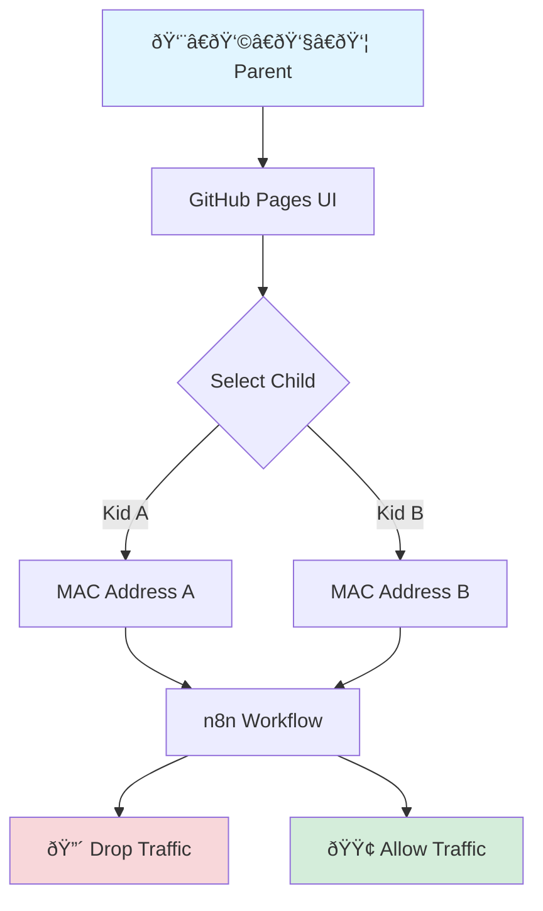

# Parental Internet Kill Switch Workflow

**Type:** flowchart
**Generated:** 2026-02-13T21:26:51.048060

```mermaid
flowchart TB
    A[👨â€ðŸ‘©â€ðŸ‘§â€ðŸ‘¦ Parent] --> B[GitHub Pages UI]
    B --> C{Select Child}
    C -->|Kid A| D[MAC Address A]
    C -->|Kid B| E[MAC Address B]
    D --> F[n8n Workflow]
    E --> F
    F --> G[🔴 Drop Traffic]
    F --> H[🟢 Allow Traffic]

    style A fill:#e1f5ff
    style G fill:#f8d7da
    style H fill:#d4edda
```
