# n8n Bespoke Automation Flow

**Type:** sequence
**Asset ID:** MM.08
**Generated:** 2026-02-13T21:51:20.170336

```mermaid
sequenceDiagram
    participant Wife as 👩 Wife
    participant UI as 🌐 GitHub Pages
    participant N8N as ⚙ n8n Engine
    participant Router as 📡 Home Router

    Wife->>UI: 👆 Toggle internet off
    UI->>N8N: 🔔 Trigger webhook
    N8N->>N8N: 🔍 Lookup MAC address
    N8N->>Router: 🛡 Apply firewall rule
    Router-->>N8N: ✅ Rule confirmed
    N8N-->>UI: 📊 Status updated
    UI-->>Wife: 👍 Done!
```

---

*Generated by BulkMermaidGenerator.py*
*To render: paste the mermaid code into https://mermaid.live*
