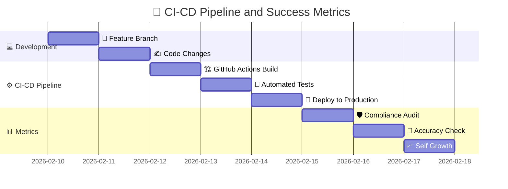

# 🎯 CI-CD Pipeline and Success Metrics

**Type:** gantt
**Asset ID:** MM.09
**Generated:** 2026-02-13T21:51:21.446111

---

*Generated by BulkMermaidGenerator.py*
*To render: paste the mermaid code into https://mermaid.live*
