# Your Delivery Pilot Journey

**Type:** flowchart
**Asset ID:** MM.10
**Generated:** 2026-02-13T21:51:22.734694

```mermaid
flowchart TB
    A["📋 Take Assessment"] --> B["🔍 Identify Gaps"]
    B --> C["🎬 Watch Simulation"]
    C --> D["📥 Clone the Repo"]
    D --> E["⚙ Configure Environment"]
    E --> F["🔨 Build Your Tools"]
    F --> G["🚀 Launch as Delivery Pilot"]
    G --> H["🏆 Build the Future!"]

    style A fill:#3498db,color:#fff
    style B fill:#9b59b6,color:#fff
    style C fill:#e67e22,color:#fff
    style D fill:#2ecc71,color:#fff
    style E fill:#1abc9c,color:#fff
    style F fill:#f39c12,color:#fff
    style G fill:#e74c3c,color:#fff
    style H fill:#f1c40f,color:#333
```

---

*Generated by BulkMermaidGenerator.py*
*To render: paste the mermaid code into https://mermaid.live*
