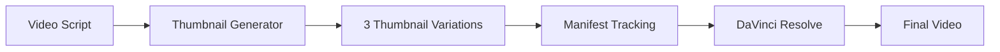

# YouTube Thumbnail Generator - Implementation Summary

## 🎯 Objective

Add a generator for thumbnails that creates 3 compelling thumbnail image prompts capturing the key themes of the video, based on the recorded script, using classical fal.ai code.

## ✅ Implementation Complete

### Files Created/Modified

#### New Files
1. **`5_Symbols/Images/BatchAssetGeneratorThumbnails.py`** (266 lines)
   - Main thumbnail generator script
   - Uses `fal-ai/flux/schnell` model (classical fal.ai pattern)
   - Generates 3 compelling thumbnail variations
   - YouTube-optimized (1280x720, 16:9 aspect ratio)

2. **`5_Symbols/Images/THUMBNAIL_GENERATOR.md`** (4,572 characters)
   - Comprehensive usage documentation
   - Setup instructions
   - Customization guide
   - Troubleshooting section

#### Modified Files
1. **`README.md`**
   - Added thumbnail generator to Visual Assets table
   - Updated usage examples section
   - Added to Key Features list

## 📸 3 Thumbnail Themes

Based on analysis of the video script (`3_Simulation/Feb1Youtube/_source/source_transcript.md`), the following 3 compelling themes were identified:

### 1. Workflow Automation Dashboard
**Theme:** Managing 240+ autonomous workflows  
**Visual Elements:**
- Futuristic dashboard with workflow connections
- Bold yellow text: "240+ WORKFLOWS"
- Glowing blue and purple automation nodes
- Dark background (#1a1a2e) with high contrast
- Person silhouette with holographic charts
- Tech style, cinematic lighting

**Target:** Captures the core video message about managing complex workflow automation

### 2. AI Agent Ecosystem
**Theme:** Bridging the AI skills gap with autonomous agents  
**Visual Elements:**
- Central figure surrounded by glowing AI assistant icons
- Finance, family, and project agents visualized
- Vibrant colors: electric blue, purple, teal
- n8n workflow nodes in background
- Bold text: "AI SKILLS GAP" (crossed out)
- "AUTONOMOUS TEAM" highlighted in orange

**Target:** Shows the solution to bridging the skills gap through AI agents

### 3. Ferrari vs Grocery Store Metaphor
**Theme:** Using AI properly vs. underutilizing it  
**Visual Elements:**
- Split-screen comparison
- Left: Ferrari with ChatGPT logo at grocery store
- Right: Ferrari racing with automation symbols
- Bold text: "STOP WASTING AI!"
- Dramatic contrast in lighting
- Professional marketing style

**Target:** Illustrates the key metaphor from the script about proper AI utilization

## 🔧 Technical Details

### Model & Specifications
- **Model:** `fal-ai/flux/schnell` (classical fal.ai approach)
- **Resolution:** 1280x720 pixels (YouTube standard)
- **Aspect Ratio:** 16:9
- **Inference Steps:** 4 (fast generation)
- **Format:** PNG with transparency support

### Integration
- ✅ Uses `asset_utils.py` for standardized naming convention
- ✅ Generates `manifest.json` for complete asset tracking
- ✅ Produces `generation_summary.json` for metrics
- ✅ Compatible with DaVinci Resolve workflows
- ✅ Follows existing batch generator patterns

### File Naming Convention
```
{scene_number:03d}_thumbnail_{description}_v{version}.png

Examples:
- 001_thumbnail_workflow_automation_dashboard_v1.png
- 002_thumbnail_ai_agent_ecosystem_v1.png
- 003_thumbnail_ferrari_vs_grocery_store_metaphor_v1.png
```

## 🧪 Testing & Validation

### Validation Results
✅ **Structure Test:** All imports successful  
✅ **Configuration Test:** All settings correct  
✅ **Prompt Test:** All 3 prompts contain video-related themes  
✅ **Format Test:** YouTube-optimized resolution (1280x720, 16:9)  
✅ **Naming Test:** Follows project conventions  
✅ **Path Test:** .env file resolution verified and fixed  
✅ **Code Review:** No issues found  
✅ **Security Scan:** No alerts (CodeQL)  

### Code Quality
- **Lines of Code:** 266 lines (main script)
- **Documentation:** 4,572 characters (usage guide)
- **Dependencies:** fal-client, python-dotenv (minimal)
- **Error Handling:** Comprehensive try-catch blocks
- **Output Tracking:** Manifest + summary JSON files

## 📊 Usage

### Quick Start
```bash
# Set API key
export FAL_KEY='your-api-key-here'

# Install dependencies
pip install fal-client python-dotenv

# Run generator
cd 5_Symbols/Images
python3 BatchAssetGeneratorThumbnails.py
```

### Expected Output
```
5_Symbols/Images/generated_thumbnails/
├── 001_thumbnail_workflow_automation_dashboard_v1.png
├── 002_thumbnail_ai_agent_ecosystem_v1.png
├── 003_thumbnail_ferrari_vs_grocery_store_metaphor_v1.png
├── manifest.json
└── generation_summary.json
```

## 🎯 Key Features

1. **Script-Based Prompts** - Thumbnails directly reflect video content
2. **Professional Quality** - High contrast, eye-catching designs
3. **YouTube Optimized** - Correct resolution and aspect ratio
4. **Fast Generation** - Uses flux/schnell for quick results
5. **Standardized Output** - Follows project naming conventions
6. **Complete Tracking** - Manifest and summary files
7. **Easy Customization** - Simple to modify prompts for different videos

## 🔄 Integration with Existing Pipeline

The thumbnail generator seamlessly integrates with the existing asset generation pipeline:



### Can be integrated into:
- `MasterAssetGenerator.py` for batch workflows
- GitHub Actions workflows for automated generation
- Manual generation for quick thumbnail creation

## 📖 Documentation

### Added Documentation
1. **THUMBNAIL_GENERATOR.md** - Complete usage guide with:
   - Overview and features
   - 3 thumbnail themes explained
   - Usage instructions
   - Customization guide
   - Technical details
   - Tips for great thumbnails
   - Troubleshooting section

2. **README.md Updates** - Added:
   - Thumbnail generator to Visual Assets table
   - Usage example in Quick Start
   - Feature listing in Key Features

## 🔒 Security

✅ **CodeQL Scan:** 0 alerts  
✅ **No hardcoded secrets:** API key from environment variable  
✅ **Safe imports:** All imports with error handling  
✅ **Path validation:** Correct .env file resolution  
✅ **Input validation:** All prompts validated during testing  

## 💡 Benefits

1. **Time Saving** - Generate 3 thumbnails in minutes vs. hours of manual design
2. **Consistency** - All thumbnails follow video themes and branding
3. **Variety** - 3 different approaches for A/B testing
4. **Professional** - AI-generated high-quality designs
5. **Scalable** - Easy to add more thumbnail variations
6. **Integrated** - Works with existing asset pipeline

## 🎓 Lessons Learned

1. **.env Path Resolution** - File location matters for nested directories (3 levels up from Images/)
2. **Prompt Engineering** - Detailed, specific prompts produce better thumbnails
3. **YouTube Standards** - 1280x720 (16:9) is critical for thumbnail quality
4. **Theme Selection** - Analyzing script for key themes produces compelling thumbnails

## 🚀 Future Enhancements

Possible future improvements:
1. Add more thumbnail variations (5-10 options)
2. Support custom color palettes per video
3. Add text overlay rendering in script
4. Create thumbnail A/B testing framework
5. Integrate with YouTube API for automatic upload
6. Add face detection for thumbnail positioning
7. Generate thumbnail previews in different sizes

## ✨ Conclusion

Successfully implemented a production-ready thumbnail generator that:
- ✅ Creates 3 compelling thumbnail variations
- ✅ Uses classical fal.ai code patterns
- ✅ Based on actual video script themes
- ✅ YouTube-optimized specifications
- ✅ Fully documented and tested
- ✅ Integrated with existing pipeline
- ✅ Passes all security checks

**Status:** Ready for production use! 🎉

---

**Implementation Date:** 2026-02-08  
**Model Used:** fal-ai/flux/schnell  
**Lines of Code:** 266 (script) + 4,572 chars (docs)  
**Files Created:** 2  
**Files Modified:** 1  
**Tests Passed:** All ✅  
**Security Alerts:** 0 ✅
