### 5_Symbols - Core Source Code

This directory contains the operational source code for the project. The scripts are modular agents designed for specific asset generation tasks.

```mermaid
graph TB
    subgraph "Master Controller"
        M[MasterAssetGenerator.py]
    end
    
    subgraph "Video & Animation"
        V1[BatchAssetGeneratorVideo.py]
        V2[BatchAssetGeneratorChapterMarkers.py]
    end
    
    subgraph "Audio"
        A1[BatchAssetGeneratorMusic.py]
        A2[BatchAssetGeneratorAudio.py]
    end
    
    subgraph "Visual Assets"
        I1[BatchAssetGeneratorImages.py]
        I2[BatchAssetGeneratorIcons.py]
        I3[BatchAssetGeneratorGraphics.py]
        I4[BatchAssetGeneratorDiagrams.py]
        I5[BulkMermaidGenerator.py]
    end
    
    subgraph "Utilities"
        U1[asset_utils.py]
        U2[EstimateWeeklyVideoCost.py]
    end
    
    M --> V1
    M --> V2
    M --> A1
    M --> A2
    M --> I1
    M --> I2
    M --> I3
    M --> I4
    M --> I5
    M --> U1
    M --> U2
    
    style M fill:#e1f5ff
    style I5 fill:#fff3cd
```

**Core Scripts**:

*   **Video & Animation**:
    *   `BatchAssetGeneratorVideo.py`: Generates video clips using models like `fal-ai/minimax/video-01`. Handles aspect ratios and duration.
    *   `BatchAssetGeneratorChapterMarkers.py`: Creates title cards for video chapters.

*   **Audio**:
    *   `BatchAssetGeneratorAudio.py` / `BatchAssetGeneratorMusic.py`: Generates audio tracks, sound effects, and background music.

*   **Static Graphics**:
    *   `BatchAssetGeneratorImages.py`: General purpose image generation (photorealistic or stylized).
    *   `BatchAssetGeneratorIcons.py`: Specialized for vector-style, minimalist icons (often checks for transparency).
    *   `BatchAssetGeneratorGraphics.py`: General graphics utility.
    *   `BatchAssetGeneratorDiagrams.py`: Technical diagrams and charts.
    *   `BulkMermaidGenerator.py`: **NEW** - Generates Mermaid diagrams for workflows and documentation.

*   **Video Elements**:
    *   `BatchAssetGeneratorLowerThirds.py`: Creates overlay graphics for titling.

**Structure**:
Each script typically follows a standard pattern:
1.  Configuration & Imports.
2.  `GENERATION_QUEUE`: A list of dictionaries defining the assets to build.
3.  `generate_*()` function: Handles the API call to fal.ai.
4.  `main()`: Orchestrates the batch process, error handling, and summary reporting.
