### 5_Symbols - Core Source Code

This directory contains the operational source code for the project. The scripts are modular agents designed for specific asset generation tasks.

```mermaid
graph TB
    subgraph "Master Controller"
        M[MasterAssetGenerator.py]
    end
    
    subgraph "Base Architecture"
        B1[base/base_asset_generator.py]
        B2[base/generator_config.py]
        B3[base/__init__.py]
    end
    
    subgraph "Video & Animation"
        V1[BatchAssetGeneratorVideo.py]
        V2[BatchAssetGeneratorChapterMarkers.py]
        V3[VideoGenerator.py]
        V4[ChapterMarkersGenerator.py]
    end
    
    subgraph "Audio"
        A1[BatchAssetGeneratorMusic.py]
        A2[BatchAssetGeneratorAudio.py]
        A3[MusicGenerator.py]
        A4[AudioGenerator.py]
    end
    
    subgraph "Visual Assets"
        I1[BatchAssetGeneratorImages.py]
        I2[BatchAssetGeneratorIcons.py]
        I3[BatchAssetGeneratorGraphics.py]
        I4[BatchAssetGeneratorDiagrams.py]
        I5[BulkMermaidGenerator.py]
        I6[BulkSVGGenerator.py]
        I7[BatchAssetGeneratorLowerThirds.py]
        I8[BatchAssetGeneratorMemoryPalace.py]
    end
    
    subgraph "Utilities"
        U1[asset_utils.py]
        U2[EstimateWeeklyVideoCost.py]
        U3[test_asset_utils.py]
        U4[test_integration.py]
    end
    
    M --> B1
    V1 --> B1
    V2 --> B1
    A1 --> B1
    A2 --> B1
    I1 --> B1
    M --> U1
    
    style M fill:#e1f5ff
    style B1 fill:#fff3cd
    style I5 fill:#d4edda
    style I6 fill:#d4edda
```

**Core Scripts**:

*   **Video & Animation**:
    *   `BatchAssetGeneratorVideo.py`: Generates video clips using models like `fal-ai/minimax/video-01`. Handles aspect ratios and duration.
    *   `VideoGenerator.py`: Individual video generator with versioning support.
    *   `BatchAssetGeneratorChapterMarkers.py`: Creates title cards for video chapters.
    *   `ChapterMarkersGenerator.py`: Individual chapter marker generator.

*   **Audio**:
    *   `BatchAssetGeneratorAudio.py` / `BatchAssetGeneratorMusic.py`: Generates audio tracks, sound effects, and background music.
    *   `AudioGenerator.py` / `MusicGenerator.py`: Individual audio/music generators with versioning.

*   **Static Graphics**:
    *   `BatchAssetGeneratorImages.py`: General purpose image generation (photorealistic or stylized).
    *   `ImageGenerator.py`: Individual image generator with versioning support.
    *   `BatchAssetGeneratorIcons.py`: Specialized for vector-style, minimalist icons (often checks for transparency).
    *   `IconGenerator.py`: Individual icon generator.
    *   `BatchAssetGeneratorGraphics.py`: General graphics utility.
    *   `GraphicsGenerator.py`: Individual graphics generator.
    *   `BatchAssetGeneratorDiagrams.py`: Technical diagrams and charts.
    *   `DiagramGenerator.py`: Individual diagram generator.
    *   `BulkMermaidGenerator.py`: ✨ **NEW** - Generates Mermaid diagrams for workflows and documentation.
    *   `BulkSVGGenerator.py`: ✨ **NEW** - Generates professional SVG diagrams for visual explanations.
    *   `SVGGenerator.py`: Individual SVG generator.

*   **Video Elements**:
    *   `BatchAssetGeneratorLowerThirds.py`: Creates overlay graphics for titling.
    *   `LowerThirdsGenerator.py`: Individual lower thirds generator.
    *   `BatchAssetGeneratorMemoryPalace.py`: Memory palace visualizations.
    *   `MemoryPalaceGenerator.py`: Individual memory palace generator.

*   **3D Assets** (🎲 NEW):
    *   `BatchAssetGenerator3D.py`: ✨ **NEW** - Generates 3D models from text descriptions using Hunyuan-3D API.
    *   `ThreeDGenerator.py`: Individual 3D model generator with base class architecture.
    *   `Batch3DModelOptimizer.py`: ✨ **NEW** - Validates and optimizes 3D models for DaVinci Resolve Fusion integration.

*   **Base Architecture** (🏗️ NEW):
    *   `base/base_asset_generator.py`: Abstract base class with shared generator logic, reducing code duplication.
    *   `base/generator_config.py`: Centralized configuration management for all generators.
    *   `base/__init__.py`: Package initialization and exports.

*   **Utilities**:
    *   `asset_utils.py`: Utilities for standardized naming, versioning, and manifest tracking.
    *   `EstimateWeeklyVideoCost.py`: Calculate API costs for batch generation.
    *   `demo_versioning_system.py`: Demonstration of versioning and manifest features.

*   **Testing**:
    *   `test_asset_utils.py`: ✅ Unit tests for asset utilities (13 tests, all passing).
    *   `test_integration.py`: ✅ End-to-end integration tests for the complete workflow.
    *   `test_3d_generator.py`: ✅ **NEW** - Unit tests for 3D generator (10 tests, all passing).
    *   `test_3d_optimizer.py`: ✅ **NEW** - Unit tests for 3D optimizer (13 tests, all passing).

**Structure**:
Each batch script typically follows a standard pattern:
1.  Configuration & Imports.
2.  `GENERATION_QUEUE`: A list of dictionaries defining the assets to build.
3.  `generate_*()` function: Handles the API call to fal.ai.
4.  `main()`: Orchestrates the batch process, error handling, and summary reporting.

**Versioning & Manifest**:
All generators now support:
- Standardized naming (Python format): `{scene:03d}_{asset_type}_{desc}_v{version}.{ext}`
  - Example: `001_image_ferrari_v1.png`, `004_video_streets_v2.mp4`
- Manifest tracking: Complete prompt-to-file traceability
- Version control: Automatic version numbering for iterations

For detailed documentation, see [VERSIONING_AND_MANIFEST.md](VERSIONING_AND_MANIFEST.md).

**Output Format Optimization** (✨ NEW):
Automatic format selection for optimal file sizes:
- **JPEG format** for assets with solid backgrounds (images, diagrams, chapter markers)
  - Typical savings: 40-60% smaller file size
  - High quality (quality=95) maintains visual fidelity
- **PNG format** preserved for assets requiring transparency
  - Lower thirds (video overlays)
  - Icons (isolated graphics)
  - Graphics with transparency needs
- Automatic conversion during generation with size reporting

For detailed documentation, see [OUTPUT_FORMAT_DOCUMENTATION.md](OUTPUT_FORMAT_DOCUMENTATION.md).
