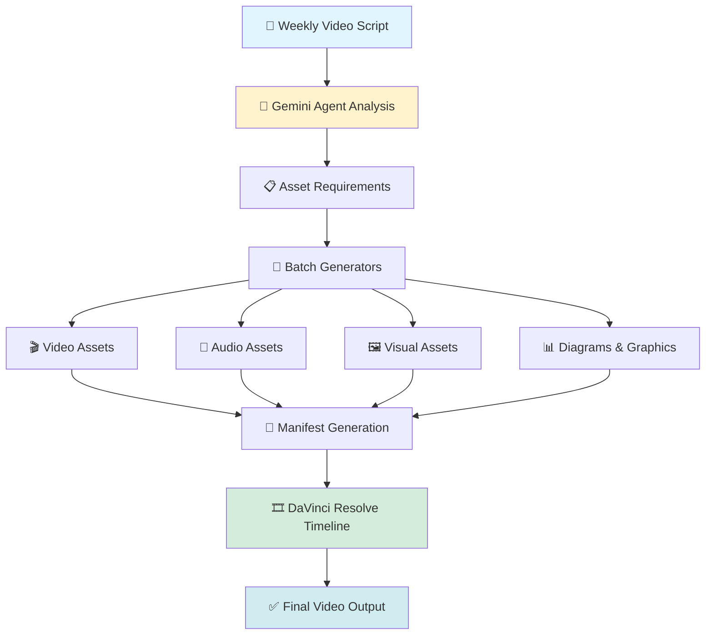
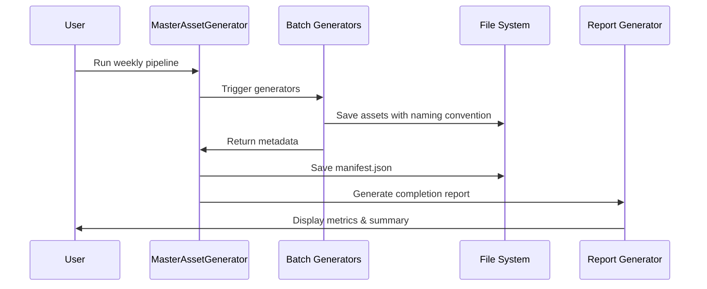
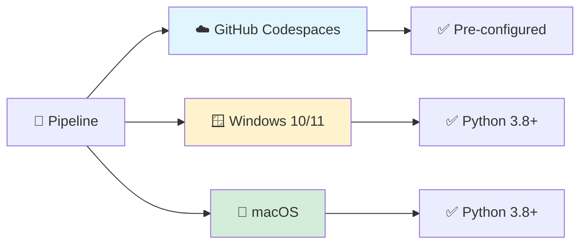
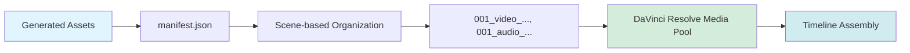

# 🎬 Weekly Video Creation Pipeline with Gemini Agent

> 🤖 **Automated multimedia asset generation pipeline using fal.ai and Gemini AI for weekly video production**

This project is a comprehensive **weekly video creation pipeline** that leverages [fal.ai](https://fal.ai) API and Gemini agent to generate high-quality visual and audio assets in bulk. The objective is to **create artifacts efficiently and integrate them seamlessly into DaVinci Resolve timelines** with standardized naming conventions for professional video editing workflows.

---

## 🎯 Pipeline Overview



### 🎯 Core Objectives

- **Bulk Asset Creation**: Generate hundreds of video, audio, and visual assets per week
- **DaVinci Resolve Integration**: Standardized naming for seamless timeline import
- **Automated Pipeline**: Minimize manual work with AI-powered generation
- **Quality & Consistency**: Maintain professional standards across all assets
- **Comprehensive Reporting**: Track generation metrics, costs, and asset inventory

---

## 📂 Project Organization

The project follows a 7-layer architecture for clear separation of concerns:

```
📁 fal.ai/
├── 🎯 1_Real_Unknown/        Objectives (OKRs) and problem definitions
├── 🌍 2_Environment/          Roadmap, tech stack, and use cases
├── 🎨 3_Simulation/           Workspace for generated assets and CLI interactions
├── 📖 4_Formula/              Setup guides, best practices, and documentation
├── 💻 5_Symbols/              Core source code - All batch generators live here
├── 🔧 6_Semblance/            Troubleshooting guides and error solutions
└── ✅ 7_Testing_known/        QA validation plans and acceptance criteria
```

### 📚 Directory Details

| Directory | Purpose | Key Files |
|-----------|---------|-----------|
| **[1_Real_Unknown](./1_Real_Unknown/README.md)** | 🎯 Objectives and Key Results | `README.md` - Project goals and KPIs |
| **[2_Environment](./2_Environment/README.md)** | 🌍 Technical Environment | `README.md` - Roadmap, tech stack, Python 3.x |
| **[3_Simulation](./3_Simulation/README.md)** | 🎨 Asset Workspace | `Feb1Youtube/` - Generated assets output |
| **[4_Formula](./4_Formula/README.md)** | 📖 Setup & Best Practices | `formula.md`, `README.md` - Usage guides |
| **[5_Symbols](./5_Symbols/README.md)** | 💻 **Core Generators** | All `.py` scripts - Main codebase |
| **[6_Semblance](./6_Semblance/README.md)** | 🔧 Troubleshooting | `README.md` - Common errors and fixes |
| **[7_Testing_known](./7_Testing_known/README.md)** | ✅ Quality Assurance | `README.md` - Validation strategies |

---

## 🎨 Core Asset Generators

All generators are located in the `5_Symbols/` directory and follow a consistent batch-processing pattern.

### 🎮 Master Controller

| Generator | Description | Output |
|-----------|-------------|--------|
| 🎛️ **`MasterAssetGenerator.py`** | Orchestrates all generators, creates unified manifest | `manifest.json` with complete asset tracking |

### 🎥 Video & Animation

| Generator | Description | Models Used |
|-----------|-------------|-------------|
| 🎬 **`BatchAssetGeneratorVideo.py`** | B-roll video clips (1080p/4k) | `fal-ai/minimax/video-01` |
| 🎞️ **`BatchAssetGeneratorChapterMarkers.py`** | Chapter title cards | Image generation models |

### 🎵 Audio Assets

| Generator | Description | Models Used |
|-----------|-------------|-------------|
| 🎵 **`BatchAssetGeneratorMusic.py`** | Background music tracks | Audio generation models |
| 🔊 **`BatchAssetGeneratorAudio.py`** | Sound effects and audio clips | Audio generation models |

### 🖼️ Visual Assets

| Generator | Description | Models Used |
|-----------|-------------|-------------|
| 🖼️ **`BatchAssetGeneratorImages.py`** | Photorealistic images | `fal-ai/flux/schnell` |
| 🎌 **`BatchAssetGeneratorAnime.py`** | **NEW** - Bulk anime generator with storyline support | `fal-ai/minimax/video-01`, Kling, Flux |
| 🎨 **`BatchAssetGeneratorGraphics.py`** | General graphics and artwork | Image generation models |
| 🧩 **`BatchAssetGeneratorIcons.py`** | Vector-style minimalist icons | Image generation models |
| 📊 **`BatchAssetGeneratorDiagrams.py`** | Technical diagrams and charts | Image generation models |
| 🗺️ **`BulkMermaidGenerator.py`** | Mermaid diagrams for documentation and workflows | Text-to-diagram generation |
| 🎨 **`BulkSVGGenerator.py`** | **NEW** - SVG diagrams for visual explanations | SVG generation |
| 🏛️ **`BatchAssetGeneratorMemoryPalace.py`** | Memory palace visualizations | Image generation models |
| 📺 **`BatchAssetGeneratorLowerThirds.py`** | Text overlay graphics for video | Image generation models |

### 🎲 3D Assets

| Generator | Description | Models Used |
|-----------|-------------|-------------|
| 🎲 **`BatchAssetGenerator3D.py`** | **NEW** - 3D models from text descriptions | `fal-ai/hunyuan-3d/v3.1/rapid/text-to-3d` |
| 🎲 **`ThreeDGenerator.py`** | 3D asset generator with base class architecture | Hunyuan-3D text-to-3D |
| 🔧 **`Batch3DModelOptimizer.py`** | **NEW** - Validates and optimizes 3D models for DaVinci Resolve Fusion | Supports FBX, OBJ, DAE, GLB |

### 🛠️ Utilities & Testing

| File | Purpose |
|------|---------|
| 🔧 **`asset_utils.py`** | Utilities for standardized naming and manifest tracking |
| 💰 **`EstimateWeeklyVideoCost.py`** | Calculate API costs for batch generation |
| 🎭 **`demo_versioning_system.py`** | Demonstration of versioning and manifest features |
| ✅ **`test_asset_utils.py`** | Unit tests for asset utilities (13 tests) |
| ✅ **`test_integration.py`** | End-to-end integration tests |

### 🏗️ Base Architecture

| Directory/File | Purpose |
|----------------|---------|
| 📁 **`base/`** | Base classes for refactored generator architecture |
| 🧩 **`base/base_asset_generator.py`** | Abstract base class with shared generator logic |
| ⚙️ **`base/generator_config.py`** | Centralized configuration management |
| 📦 **`base/__init__.py`** | Package initialization and exports |

---

## 📋 Asset Versioning & Manifest System

✨ **Smart Asset Management** - Every generated asset is automatically tracked and versioned.

### 🏷️ Standardized Naming Convention

All assets follow a consistent naming pattern:
```
{scene_number:03d}_{asset_type}_{clean_desc}_v{version}.{ext}
```

**Examples:**
- `001_image_ferrari_cart_morph_v1.png` - Scene 1, Image, version 1
- `004_video_empty_uk_streets_v2.mp4` - Scene 4, Video, version 2
- `011_icon_ai_brain_network_v1.svg` - Scene 11, Icon, version 1

### 📝 Unified Manifest Tracking



The `MasterAssetGenerator.py` creates a comprehensive `manifest.json` that maps:
- 📁 **Filename** → Full file path (DaVinci Resolve compatible)
- 📝 **Prompt** → Complete generation prompt used
- ⏰ **Timestamp** → When the asset was created
- 🔗 **Result URL** → Original fal.ai result URL
- 📊 **Metadata** → Scene info, priority, model used, etc.

**Benefits:**
- 🔍 Easily find assets by scene number or type
- 📜 Complete traceability from prompt to final file
- 🔄 Version control for asset iterations
- 🤖 Automated tracking—no manual logging needed
- 🎞️ **DaVinci Resolve Ready** - Import directly into timeline using standardized names

For comprehensive documentation, see **[VERSIONING_AND_MANIFEST.md](./5_Symbols/VERSIONING_AND_MANIFEST.md)**.

---

## 💻 Environment Support

This pipeline runs seamlessly on multiple platforms:



### Platform Requirements

| Platform | Requirements | Notes |
|----------|--------------|-------|
| **☁️ GitHub Codespaces** | Pre-configured devcontainer | Recommended for teams |
| **🪟 Windows 10/11** | Python 3.8+, pip | Works in PowerShell/CMD |
| **🍎 macOS** | Python 3.8+, pip | Native support |

---

## 🚀 Quick Start Guide

### 1️⃣ Install Dependencies

```bash
# Create virtual environment
python3 -m venv .venv
source .venv/bin/activate  # On Windows: .venv\Scripts\activate

# Install required packages
pip install -r requirements.txt
# OR install directly:
pip install fal-client
```

### 2️⃣ Configure API Key

**📖 For detailed instructions**, see the **[API Key Setup Guide](./4_Formula/api_key_setup.md)**.

**Quick Setup:**
```bash
# Set your fal.ai API key
export FAL_KEY="your-api-key-here"

# Or add to .env file:
echo 'FAL_KEY=your-api-key-here' > .env
```

The guide covers:
- How to get your API key from fal.ai dashboard
- Multiple configuration methods (environment variable, .env file, shell config)
- Verification and troubleshooting steps
- Security best practices

### 3️⃣ Run Generators

**Run Individual Generators:**
```bash
# Generate video assets
python3 5_Symbols/Video/BatchAssetGeneratorVideo.py

# Generate anime with storyline (NEW - located in Images folder)
python3 5_Symbols/Images/BatchAssetGeneratorAnime.py --create-example
python3 5_Symbols/Images/BatchAssetGeneratorAnime.py --storyline anime_storyline.json

# Generate image assets
python3 5_Symbols/Images/BatchAssetGeneratorImages.py

# Generate music tracks
python3 5_Symbols/Audio/BatchAssetGeneratorMusic.py

# Generate 3D models
python3 5_Symbols/ThreeD/BatchAssetGenerator3D.py
```

**Run Master Controller (All Generators):**
```bash
# Navigate to 5_Symbols directory
cd 5_Symbols

# Run master generator with project directory
python MasterAssetGenerator.py ../3_Simulation/Feb1Youtube
```

The Master Controller will:
1. 📊 Load configuration
2. 💰 Estimate API costs
3. ❓ Prompt for confirmation
4. 🚀 Generate all assets with standardized naming
5. 📝 Track everything in manifest.json
6. 📊 **Generate completion report**
7. ✅ Save complete manifest and report in project directory

### 4️⃣ View Generated Reports

After every run, the pipeline generates comprehensive reports:

```bash
# View the latest generation report
cat 3_Simulation/Feb1Youtube/weekly/generation_report_YYYY-MM-DD.md

# View cost analysis
cat 3_Simulation/Feb1Youtube/weekly/cost_report_YYYY-MM-DD.md
```

**Report Contents:**
- ✅ Assets successfully generated
- ❌ Failed generations (if any)
- 💰 Total API costs
- ⏱️ Generation time
- 📊 Asset breakdown by type
- 🎞️ DaVinci Resolve import instructions

---

## 🤖 GitHub Actions Workflows

The project includes automated workflows that can generate assets via GitHub Actions, perfect for scheduled generation or manual triggers.

### 🔑 Setup: Configure FAL_API_KEY Secret

**Before running any workflows**, you must add your fal.ai API key as a repository secret:

1. Go to your repository's **Settings** → **Secrets and variables** → **Actions**
2. Click **"New repository secret"**
3. Name: `FAL_API_KEY`
4. Value: Your fal.ai API key (get it from [fal.ai/dashboard/keys](https://fal.ai/dashboard/keys))
5. Click **"Add secret"**

This secret is automatically passed to all asset generation workflows that require it. Workflows using only SVG or Mermaid generators (which don't use the fal.ai API) don't require this secret.

### 🚀 Available Workflows

| Workflow | Description | Trigger |
|----------|-------------|---------|
| **Bulk SVG Generator** | Generates SVG diagrams for documentation | Manual or on push |
| **Bulk Mermaid Generator** | Generates Mermaid diagrams in Markdown | Manual or on push |
| **All Bulk Generators** | Runs multiple generators at once | Manual only |

### 📖 How to Run Workflows

#### From GitHub UI:
1. Go to **Actions** tab in the repository
2. Select the workflow from the left sidebar
3. Click **"Run workflow"** button
4. Choose options (generators to run, commit/push settings)
5. Click **"Run workflow"** to start

#### From GitHub Codespaces:
All workflows are designed to work in Codespaces with commit/push capabilities:

```bash
# Run SVG generator
gh workflow run bulk-svg-generator.yml

# Run Mermaid generator
gh workflow run bulk-mermaid-generator.yml

# Run all generators
gh workflow run all-bulk-generators.yml -f generators=all

# Run without committing
gh workflow run bulk-svg-generator.yml -f commit_and_push=false
```

### 🎨 What Gets Generated

- **SVG files**: Professional diagrams in `3_Simulation/Feb1Youtube/weekly/generated_svgs/`
- **Mermaid diagrams**: Documentation in `5_Symbols/generated_mermaid_diagrams/`
- **Manifest files**: `manifest.json` with complete asset tracking
- **Summary reports**: `generation_summary.json` with metrics

### 📦 Artifacts

Each workflow uploads generated files as artifacts (retained for 30 days). Workflows can also automatically commit and push generated files back to the repository.

**See [.github/workflows/README.md](.github/workflows/README.md) for complete workflow documentation.**

---

## 🎞️ DaVinci Resolve Integration

Import your generated assets directly into DaVinci Resolve with the standardized naming convention:



### Import Steps:

1. **Open DaVinci Resolve** and create a new project
2. **Navigate to Media Pool** → Right-click → Import Media
3. **Select generated assets folder**: `3_Simulation/Feb1Youtube/generated_assets_*`
4. Assets will be organized by scene number (001, 002, 003...)
5. **Drag and drop** to timeline in sequential order
6. Use the manifest.json for prompt reference and metadata

### Naming Benefits:
- 🔢 **Scene numbering** keeps assets in correct order
- 🎯 **Asset type prefix** helps filter (video, audio, image)
- 📝 **Descriptive names** make identification easy
- 🔄 **Version numbers** track iterations

---

## 📖 Detailed Documentation

- **[🎌 Anime Generator Guide](./5_Symbols/Images/ANIME_GENERATOR_GUIDE.md)** - Complete guide for bulk anime generation with storylines **NEW**
- **[🔑 API Key Setup](./4_Formula/api_key_setup.md)** - Comprehensive guide to getting, saving, and using your fal.ai API key
- **[Setup & Best Practices](./4_Formula/README.md)** - Installation, configuration, and usage tips
- **[Versioning System](./5_Symbols/VERSIONING_AND_MANIFEST.md)** - Complete guide to asset naming and manifest
- **[Implementation Summary](./IMPLEMENTATION_SUMMARY.md)** - Technical details of recent improvements
- **[Troubleshooting Guide](./6_Semblance/README.md)** - Common issues and solutions
- **[Testing Strategy](./7_Testing_known/README.md)** - QA validation and acceptance criteria

---

## 💡 Key Features

✨ **Automated Asset Generation**
- 🎬 Video clips (B-roll, animations)
- 🎌 Anime scenes (bulk generation with storylines) **NEW**
- 🎵 Audio tracks (music, sound effects)
- 🖼️ Images (photorealistic, stylized)
- 🧩 Icons & graphics (vector-style)
- 📺 Video elements (lower thirds, chapter markers)
- 🎲 3D models (text-to-3D using Hunyuan-3D)

🎯 **Smart Asset Management**
- 🏷️ Standardized naming with scene numbers
- 📝 Automatic manifest generation
- 🔄 Built-in version control
- 📊 Complete metadata tracking

🔧 **Developer-Friendly**
- 🐍 Pure Python 3.x
- 📦 Minimal dependencies (fal-client)
- 🧪 Comprehensive test suite
- 📚 Well-documented codebase

---

## 🧪 Testing

Run the test suite to verify everything works:

```bash
cd 5_Symbols

# Run unit tests
python test_asset_utils.py

# Run integration tests
python test_integration.py

# Demo versioning system
python demo_versioning_system.py
```

**Test Coverage:**
- ✅ 13 unit tests for asset utilities
- ✅ Integration tests for end-to-end workflows
- ✅ Demo scripts for feature demonstration

---

## 🛠️ Troubleshooting

### Common Issues

**🔑 Missing API Key**
```
Error: "FAL_KEY environment variable not set"
Solution: export FAL_KEY='your-key-here'
```

**📦 Module Not Found**
```
Error: ModuleNotFoundError: No module named 'fal_client'
Solution: pip install fal-client
```

**⏱️ API Timeouts**
```
Error: "Generation failed: No video URL"
Solution: Check generation_summary.json for failed assets, then retry
```

For more troubleshooting help, see **[6_Semblance/README.md](./6_Semblance/README.md)**.

---

## 📊 Project Status

| Component | Status | Tests |
|-----------|--------|-------|
| 🎬 Video Generation | ✅ Complete | Passing |
| 🎵 Audio Generation | ✅ Complete | Passing |
| 🖼️ Image Generation | ✅ Complete | Passing |
| 🧩 Icon Generation | ✅ Complete | Passing |
| 📝 Manifest System | ✅ Complete | Passing |
| 🏷️ Versioning System | ✅ Complete | Passing |
| 🏗️ Base Class Architecture | ✅ Complete | Passing |
| 🤖 GitHub Actions (14 workflows) | ✅ Complete | Operational |
| 🧪 Test Suite | ✅ Complete | 13/13 Passing |
| 📚 Documentation | ✅ Complete | N/A |

---

## 🎯 Use Cases

- **📅 Weekly Video Production** - Automated asset generation for regular YouTube/social media content
- **🎬 Educational Content** - Create course materials, tutorials, and explainer videos
- **🎨 Marketing Campaigns** - Batch-generate visual assets for ads and promotions
- **🎵 Podcast Enhancement** - Add visual elements to audio podcasts for video platforms
- **📊 Corporate Communications** - Generate consistent branded assets for internal videos
- **🧩 Documentation** - Create diagrams, icons, and visual aids for technical docs
- **🎞️ DaVinci Resolve Workflows** - Professional video editing with organized asset imports

---

## 📜 License

This project is a general-purpose weekly video creation pipeline. See individual files for specific licensing information.

---

## 🤝 Contributing

Contributions are welcome! Please ensure:
- ✅ All tests pass (`python test_asset_utils.py`)
- 📝 Code follows existing patterns and conventions
- 📚 Documentation is updated for new features
- 🔒 No API keys are committed to the repository

---

## 📞 Support

For issues, questions, or suggestions:
1. 📖 Check the [Troubleshooting Guide](./6_Semblance/README.md)
2. 📚 Review the [Documentation](./4_Formula/README.md)
3. 🐛 Open an issue on GitHub

---

**Made with ❤️ using [fal.ai](https://fal.ai) generative AI models**
